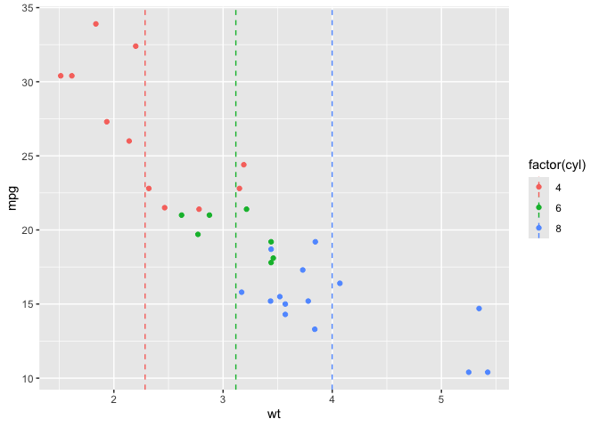

- [`qstat`](#qstat)
- [then define user-facing `qlayer()`, which gives the presets of
  geom_point and
  stat_identity.](#then-define-user-facing-qlayer-which-gives-the-presets-of-geom_point-and-stat_identity)
- [maybe something sf-facing](#maybe-something-sf-facing)
  - [geom_means](#geom_means)
  - [geom_center_label](#geom_center_label)
  - [geom_post](#geom_post)
  - [geom_xmean](#geom_xmean)
  - [geom_quantile](#geom_quantile)
  - [`geom_highlight()`](#geom_highlight)
- [One-liners?](#one-liners)
  - [`geom_xmean_line()` in 137
    characters](#geom_xmean_line-in-137-characters)
  - [`geom_xmean` in 99 characters](#geom_xmean-in-99-characters)
  - [`geom_post()` in 101 characters, `stat_expectedvalue()` in 113,
    `geom_expectedvalue_label()`
    171…](#geom_post-in-101-characters-stat_expectedvalue-in-113-geom_expectedvalue_label-171)

``` r
devtools::create(".")
```

> … creating new stats is one of the most useful ways to extend the
> capabilities of ggplot2.’ – ggplot2: Elegant Graphics for Data
> Analysis *Yes!*

Current methods for defining new user-facing stat and geom functions may
be considered prohibitive for in-script, on-the-fly-use. statexpress
attempts to make concise definition possible - almost as concise as the
pre-processing of data that you might have to do *in absence* of the
proposed statexpress functionality. With statexpress, extending
ggplot2’s capabilities by creating under-the-hood statisical
transformation routines could happen *not only* as development activity,
but also in data-analytic contexts.

Because creating new stats is so useful and can contribute so much to
user’s expressiveness w/ ggplot2 and because users are likely to intuit
how Stats and Geoms work together at a high level, perhaps it’s an
activity that should hold a special place in the extension world - where
not so much is expected of extenders as is suggested by some resources
(e.g. Internals Chapter of ggplot2 which follows):

> *Maybe not?* For a ggplot2 developer who hopes to design extensions,
> however, … understanding \[how ggplot2 translates this plot
> specification into an image\] is paramount. (ggplot2 internals)

> … the ease with which extensions can be made means that writing
> one-off extensions to solve a particular plotting challenge is also
> viable. *(More true with shortcut?)*

A few approaches have been combine here.

1.  `qstat()`…
2.  `qlayer()`…

Let’s go!

# `qstat`

``` r
knitrExtra:::chunk_to_r("a_qstat")
#> It seems you are currently knitting a Rmd/Qmd file. The parsing of the file will be done in a new R session.
```

``` r
qstat <- function(compute_group = ggplot2::Stat$compute_group, ...) {

  ggproto("StatTemp", Stat, compute_group = compute_group, ...)
  
}
```

# then define user-facing `qlayer()`, which gives the presets of geom_point and stat_identity.

``` r
knitrExtra:::chunk_to_r("b_qlayer")
#> It seems you are currently knitting a Rmd/Qmd file. The parsing of the file will be done in a new R session.
```

``` r
qlayer <- function (mapping = NULL, data = NULL, stat = "identity", geom = "point", position = "identity", 
    ..., na.rm = FALSE, show.legend = NA, inherit.aes = TRUE) 
{
    layer(data = data, mapping = mapping, stat = stat, geom = geom, 
        position = position, show.legend = show.legend, inherit.aes = inherit.aes, 
        params = rlang::list2(na.rm = na.rm, ...))
}
```

# maybe something sf-facing

## geom_means

``` r
library(tidyverse)
group_means <- function(data, scales){
  
 data |> 
    summarise(x = mean(x),
              y = mean(y))
  
}

geom_means <- function(...){
  geom_point(stat = qstat(group_means), ...)
}

mtcars |>
  ggplot() + 
  aes(x = wt,
      y = mpg) + 
  geom_point() + 
  geom_means(size = 6)
```

<!-- -->

``` r

last_plot() + 
  aes(color = factor(cyl))
```

<!-- -->

## geom_center_label

``` r
group_label_at_center <- function(data, scales){
  
 data %>% 
    group_by(label) %>% 
    summarise(x = mean(x, na.rm = T),
              y = mean(y, na.rm = T))
  
}

geom_center_label <- function(...){
  geom_label(stat = qstat(group_label_at_center), ...)
}


palmerpenguins::penguins |>
  ggplot() +
  aes(x = bill_length_mm,
      y = bill_depth_mm) +
  geom_point() +
  aes(label = "All") +
  geom_center_label()
#> Warning: Removed 2 rows containing missing values or values outside the scale range
#> (`geom_point()`).
```

<!-- -->

``` r


last_plot() +
  aes(color = species, label = species)
#> Warning: Removed 2 rows containing missing values or values outside the scale range
#> (`geom_point()`).
```

<!-- -->

``` r


geom_center_text <- function(...){
  geom_text(stat = qstat(group_label_at_center), ...)
}


palmerpenguins::penguins |>
  ggplot() +
  aes(x = bill_length_mm,
      y = bill_depth_mm) +
  geom_point(aes(color = bill_length_mm)) +
  aes(color = species) +
  geom_center_text(color = "Black",
    aes(label = species), 
                     
                    alpha = .8,
                   size = 5, 
                   fontface = "bold")
#> Warning: Removed 2 rows containing missing values or values outside the scale range
#> (`geom_point()`).
```

<!-- -->

``` r

layer_data(i = 2)
#>       label        x        y PANEL group colour size angle hjust vjust alpha
#> 1    Adelie 38.79139 18.34636     1    -1  Black    5     0   0.5   0.5   0.8
#> 2 Chinstrap 48.83382 18.42059     1    -1  Black    5     0   0.5   0.5   0.8
#> 3    Gentoo 47.50488 14.98211     1    -1  Black    5     0   0.5   0.5   0.8
#>   family fontface lineheight
#> 1            bold        1.2
#> 2            bold        1.2
#> 3            bold        1.2
```

## geom_post

``` r
compute_post <- function(data, scales){
  
  data %>% 
    mutate(xend = x,
           yend = 0)
  
}

geom_post <- function(...){
  geom_segment(stat = qstat(compute_post), ...)
}


data.frame(outcome = 0:1, prob = c(.4, .6)) |>
  ggplot() + 
  aes(x = outcome,
      y = prob) + 
  geom_post() + 
  geom_point() + 
  labs(title = "probability by outcome")
```

<!-- -->

## geom_xmean

``` r
compute_xmean <- function(data, scales){
  
  data %>% 
    summarize(xintercept = mean(x))
  
}

geom_xmean <- function(...){
  qlayer(stat = qstat(compute_xmean, 
                      dropped_aes = c("x", "y")), 
         geom = "vline", ...)
}

mtcars |>
  ggplot() + 
  aes(x = wt,
      y = mpg) + 
  geom_point() + 
  geom_xmean(linetype = "dashed")
```

<!-- -->

``` r

last_plot() + 
  aes(color = factor(cyl))
```

<!-- -->

## geom_quantile

``` r
compute_xy_quantile <- function(data, scales, q = .5){
  
  data %>% 
    summarise(x = quantile(x, q),
              y = quantile(y, q)) 
  
}

geom_quantile <- function(...){
  geom_point(stat = qstat(compute_xy_quantile), ...)  #adding point means that aes is automatically figured out! ok
}

mtcars |>
  ggplot() +
  aes(x = wt,
      y = mpg) +
  geom_point() +
  geom_quantile(size = 8, aes(color = "q = .5"), q = .5) +
  geom_quantile(size = 8, q = 1, aes(color = "q =  1")) +
  geom_quantile(aes(color = "q =  .9"), size = 8, q = .9)
```

<!-- -->

## `geom_highlight()`

``` r
compute_panel_highlight <- function(data, scales, which_id = NULL){

data %>% 
  arrange(highlight_condition) %>%
  mutate(group = fct_inorder(grouping))
  
}

stat_highlight <- function(geom = "line", ...){
  
  qlayer(stat = qstat(compute_panel = compute_panel_highlight, 
                      default_aes = 
                        aes(color = after_stat(highlight_condition))), 
             geom = geom, 
             ...)
}

gapminder::gapminder %>% 
  filter(continent == "Americas") %>% 
  ggplot() + 
  aes(x = year, y = lifeExp, 
      grouping = country, 
      highlight_condition = 
        country == "Bolivia") + 
  stat_highlight(linewidth = 3)
```

<!-- -->

``` r

gapminder::gapminder %>% 
  filter(year == 2002) %>% 
  ggplot() + 
  aes(x = gdpPercap, y = lifeExp, 
      grouping = continent, 
      highlight_condition = 
        continent == "Europe") + 
  stat_highlight(geom = "point") + 
  scale_x_log10() + 
  scale_color_manual(values = c("grey", "darkolivegreen"))
```

<!-- -->

# One-liners?

Since were organize with variable function input in first position and
geom in section position, and we can do one-liners (or two) use
positioning for arguments.

## `geom_xmean_line()` in 137 characters

``` r
library(tidyverse)

geom_xmean_line <- function(...){qlayer(stat = qstat(compute_group = function(data, scales){data |> summarize(xintercept = mean(x))}, dropped_aes = c("x", "y")), geom =  "vline", ...)}


ggplot(cars) +
  aes(speed, dist) + 
  geom_point() + 
  geom_xmean_line(linetype = 'dashed')
```

<!-- -->

``` r
  
last_plot() + 
  aes(color = dist > 50)
```

<!-- -->

``` r

ggplot(cars) +
  aes(speed, dist) + 
  geom_point() + 
  geom_xmean_line(linetype = 'dashed', 
                  data = . %>% tail,
                  aes(color = dist > 50))
```

<!-- -->

``` r

ggplot(cars) +
  aes(speed, dist) + 
  geom_point() + 
  geom_xmean_line(data = . %>% filter(speed < 10))
```

<!-- -->

## `geom_xmean` in 99 characters

``` r
geom_xmean <- function(...){geom_point(stat = qstat(function(data, scales){data |> summarize(x = mean(x), y = I(.025))}), ...)}

ggplot(cars) +
  aes(speed, dist) + 
  geom_point() + 
  geom_xmean(size = 8, shape = "diamond") 
```

<!-- -->

``` r

last_plot() + 
  aes(color = dist > 50)
```

<!-- -->

## `geom_post()` in 101 characters, `stat_expectedvalue()` in 113, `geom_expectedvalue_label()` 171…

May I buy a visually enhanced probability lesson for 400 characters? Yes
please.

``` r
geom_post <- function(...){geom_segment(stat = qstat(function(data,scales){data |> mutate(xend = x, yend = 0)}), ...)}

data.frame(prob = c(.4,.6), outcome = c(0, 1)) %>% 
ggplot(data = .) +
  aes(outcome, prob) + 
  geom_post() +
  geom_point() 
```

<!-- -->

``` r

stat_expectedvalue <- function(geom = "point", ...){
  
  qlayer(stat = qstat(function(data, scales){data |> summarise(x = sum(x*y), y = 0)},
                      default_aes = aes(label = after_stat(round(x, 2)))), 
             geom = geom, 
             ...)
  
  } # point is default geom

last_plot() + 
  stat_expectedvalue()
```

<!-- -->

``` r

last_plot() +
  stat_expectedvalue(geom = "text", vjust = 0) + 
  stat_expectedvalue(geom = "text", label = "The Expected Value",
                     vjust = 1)
```

<!-- -->

``` r
knitr::knit_exit()
```
