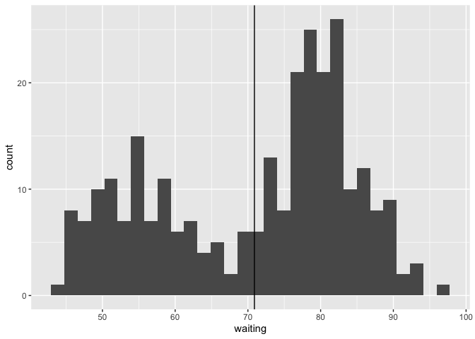
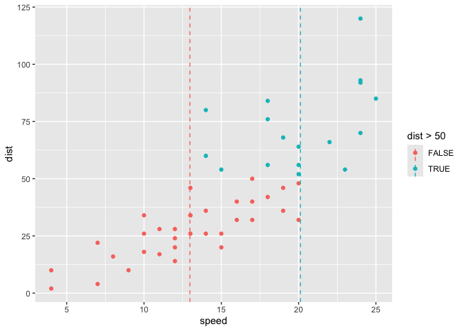

- [`qstat`](#qstat)
- [`qlayer()`](#qlayer)
  - [see sf2stat for sf-specific function
    qlayer_sf](#see-sf2stat-for-sf-specific-function-qlayer_sf)
- [a bunch of examples and ad-hoc
  tests…](#a-bunch-of-examples-and-ad-hoc-tests)
  - [geom_means](#geom_means)
  - [geom_center_label](#geom_center_label)
  - [geom_post](#geom_post)
  - [geom_xmean](#geom_xmean)
  - [geom_quantile](#geom_quantile)
  - [`geom_highlight()`](#geom_highlight)
- [One-liners?](#one-liners)
  - [`geom_xmean_line()` in 137
    characters](#geom_xmean_line-in-137-characters)
  - [`geom_xmean` in 99 characters](#geom_xmean-in-99-characters)
  - [`geom_post()` in 101 characters, `stat_expectedvalue()` in 113,
    `geom_expectedvalue_label()`
    171…](#geom_post-in-101-characters-stat_expectedvalue-in-113-geom_expectedvalue_label-171)
  - [`geom_means` in 131 characters](#geom_means-in-131-characters)
  - [`geom_grouplabel_at_means()`](#geom_grouplabel_at_means)
- [Part II. Packaging and documentation 🚧
  ✅](#part-ii-packaging-and-documentation--)
  - [Phase 1. Minimal working package](#phase-1-minimal-working-package)

<!-- badges: start -->

[](https://lifecycle.r-lib.org/articles/stages.html#experimental)
<!-- badges: end -->

``` r
devtools::create(".")
```

> … creating new stats is one of the most useful ways to extend the
> capabilities of ggplot2.’ – ggplot2: Elegant Graphics for Data
> Analysis *Yes!*

Current methods for defining new user-facing stat and geom functions may
be considered prohibitive for in-script, on-the-fly-use. statexpress
attempts to make concise definition possible - almost as concise as the
pre-processing of data that you might have to do *in absence* of the
proposed statexpress functionality. With statexpress, extending
ggplot2’s capabilities by creating under-the-hood statisical
transformation routines could happen *not only* as development activity,
but also in data-analytic contexts.

Because creating new stats is so useful and can contribute so much to
user’s expressiveness w/ ggplot2 and because users are likely to intuit
how Stats and Geoms work together at a high level, perhaps it’s an
activity that should hold a special place in the extension world - where
not so much is expected of extenders as is suggested by some resources
(e.g. Internals Chapter of ggplot2 which follows):

> *Maybe not?* For a ggplot2 developer who hopes to design extensions,
> however, … understanding \[how ggplot2 translates this plot
> specification into an image\] is paramount. (ggplot2 internals)

> … the ease with which extensions can be made means that writing
> one-off extensions to solve a particular plotting challenge is also
> viable. *(More true with shortcut?)*

*Creating a geom\_() \[by defining a new Stat\] from scratch is an
involved process that doesn’t lend itself to simple transformations.*
Elio Campitelli, in blog post ‘How to make a generic stat in ggplot2’
[^1]

A few approaches have been combine here.

1.  `qstat()`…
2.  `qlayer()`…

Let’s go!

# `qstat`

A quick way to test out new Stats is to use them in combination with
geom\_\*() user facing functions. For example,

``` r
library(tidyverse)
# Step 1. Define compute
compute_group_means <- function(data, scales){
 
  data %>%
    summarise(x = mean(x, na.rm = T),
              y = mean(y, na.rm = T))
 
}

# Step 2. Define Stat
StatMeans <- ggproto("StatMeans",
                     Stat,
                     compute_group = compute_group_means)

# Step 3. Use Stat
palmerpenguins::penguins %>%
  ggplot() +
  aes(bill_length_mm, bill_depth_mm) +
  geom_point() +
  geom_point(stat = StatMeans, size = 8)
#> Warning: Removed 2 rows containing missing values or values outside the scale range
#> (`geom_point()`).
```

<!-- -->

But naming things is hard; and if we’re just starting off, we might just
want to have a way to check out our compute in a visual space kind of
directly. So we introduce a way to test out our compute without a
dedicated Stat in the global environment and without having to name it.
That might look something like this two-step process:

``` r
# Step 1. Define compute
compute_group_means <- function(data, scales){
 
  data %>%
    summarise(x = mean(x, na.rm = T),
              y = mean(y, na.rm = T))
 
}

# Step 2. Use Compute
palmerpenguins::penguins %>%
  ggplot() +
  aes(bill_length_mm, bill_depth_mm) +
  geom_point() +
  geom_point(stat = qstat(compute_group_means), size = 8)
```

And you could start thinking about something user-facing like this:

``` r
geom_means_point <- function(...){
  geom_point(stat = qstat(compute_group_means))
  }

geom_means <- geom_means_point
```

This might be enabled by a simple set of convenience functions
qstat_group, qstat_panel, and qstat_layer, where are specified as
follows. qstat is just an alias of qstat_group (and can actually be used
for panel or layer computation by spelling out compute_panel argument).

``` r
knitrExtra:::chunk_to_r("a_qstat")
#> It seems you are currently knitting a Rmd/Qmd file. The parsing of the file will be done in a new R session.
```

``` r
qstat <- function(compute_group = ggplot2::Stat$compute_group, ...) {

  ggproto("StatTemp", Stat, compute_group = compute_group, ...)
 
}

qstat_group <- function(compute_panel, ...) {

  ggproto("StatTemp", Stat, qstat_group = qstat_group, ...)
 
}

qstat_panel <- function(compute_panel, ...) {

  ggproto("StatTemp", Stat, compute_panel = compute_panel, ...)
 
}

qstat_layer <- function(compute_layer, ...) {

  ggproto("StatTemp", Stat, compute_layer = compute_layer, ...)
 
}
```

Basic example/test:

``` r
palmerpenguins::penguins %>%
  ggplot() +
  aes(bill_length_mm, bill_depth_mm) +
  geom_point() +
  geom_point(stat = qstat(compute_group_means), size = 8)
#> Warning: Removed 2 rows containing missing values or values outside the scale range
#> (`geom_point()`).
```

<!-- -->

# `qlayer()`

You might however, also need something like qlayer. This can be useful
if you want to ‘try on’ a user facing stat\_\*() function - in other
words, don’t lock in a geom. Furthermore, you’ve got to use it in cases
where user-facing geom functions don’t give you the option of changing
the Stat (no stat argument) as with geom_vline/GeomVline.

qlayer is essentially a flexible cross between geom_point and
stat_identity.

``` r
knitrExtra:::chunk_to_r("b_qlayer")
#> It seems you are currently knitting a Rmd/Qmd file. The parsing of the file will be done in a new R session.
```

``` r
qlayer <- function (mapping = NULL,
                    data = NULL,
                    stat = StatIdentity,
                    geom = GeomPoint,
                    position = position_identity(),
                    ...,
                    na.rm = FALSE,
                    show.legend = NA,
                    inherit.aes = TRUE)
{
  layer(
    data = data,
    mapping = mapping,
    stat = stat,
    geom = geom,
    position = position,
    show.legend = show.legend,
    inherit.aes = inherit.aes,
    params = rlang::list2(na.rm = na.rm, ...)
  )
}
```

``` r
stat_means <- function(geom = GeomPoint, ...){
 
  qlayer(geom = geom, stat = qstat(compute_group_means), ...)
 
}

ggplot(cars) +
  aes(speed, dist) +
  geom_point() +
  stat_means(size = 12) +
  stat_means(geom = "label",
             label = "means x and y")
```

<!-- -->

``` r

ggplot(palmerpenguins::penguins) +
  aes(bill_length_mm, bill_depth_mm) +
  geom_point() +
  aes(color = species) +
  stat_means(size = 12) +
  stat_means(geom = "label",
             aes(label = species))
#> Warning: Removed 2 rows containing missing values or values outside the scale range
#> (`geom_point()`).
```

<!-- -->

Now looking at the case of GeomVline which doesn’t have a user facing
function that allows Stat to be input.

``` r
compute_group_xmean <- function(data, scales){
 
  data %>% summarise(xintercept = mean(x))
 
}

geom_xmean_vline <- function(...){
 
  qlayer(stat = qstat(compute_group_xmean),
         geom = GeomVline, ...)
 
}


ggplot(faithful) +
  aes(waiting) +
  geom_histogram() +
  geom_xmean_vline()
#> `stat_bin()` using `bins = 30`. Pick better value with `binwidth`.
#> Warning: The following aesthetics were dropped during statistical transformation: x.
#> ℹ This can happen when ggplot fails to infer the correct grouping structure in
#>   the data.
#> ℹ Did you forget to specify a `group` aesthetic or to convert a numerical
#>   variable into a factor?
```

<!-- -->

Here’s a good moment to show that qstat can also be used to more fully
flesh out a hypothetical stat. Given the warning we might define a quick
stat within the user-facing layer, so that we are warning-free.

``` r
geom_xmean_vline <- function(...){
 
  QStat <- qstat(compute_group_xmean,
                 dropped_aes = "x")
 
  qlayer(stat = QStat,
         geom = GeomVline, ...)
 
}

ggplot(faithful) +
  aes(waiting) +
  geom_histogram() +
  geom_xmean_vline()
#> `stat_bin()` using `bins = 30`. Pick better value with `binwidth`.
```

<!-- -->

It is also possible of course to commit to a Stat, and use qlayer to
speed your definitions along, if you’re layer specification is
anticipated to be a tad vanilla (as mine, for example, mostly are!).

``` r


stat_means <- function(geom = "point", ...){
 
  qlayer(geom = geom, stat = StatMeans, ...)
 
}

ggplot(palmerpenguins::penguins) +
  aes(bill_length_mm, bill_depth_mm) +
  geom_point() +
  aes(color = species) +
  stat_means(size = 12) +
  stat_means(geom = "label",
             aes(label = species))
#> Warning: Removed 2 rows containing missing values or values outside the scale range
#> (`geom_point()`).
```

<!-- -->

## see sf2stat for sf-specific function qlayer_sf

# a bunch of examples and ad-hoc tests…

## geom_means

test

``` r
library(tidyverse)
group_means <- function(data, scales){
 
 data |>
    summarise(x = mean(x),
              y = mean(y))
 
}

geom_means <- function(...){
  geom_point(stat = qstat(group_means), ...)
}

mtcars |>
  ggplot() +
  aes(x = wt,
      y = mpg) +
  geom_point() +
  geom_means(size = 6)
```

<!-- -->

``` r

last_plot() +
  aes(color = factor(cyl))
```

<!-- -->

``` r

mtcars |>
  ggplot() +
  aes(x = wt,
      y = mpg) +
  aes(color = factor(cyl)) +
  geom_point(show.legend = F) +
  geom_means(size = 6, show.legend = F)
```

<!-- -->

``` r

mtcars |>
  ggplot() +
  aes(x = wt,
      y = mpg) +
  geom_point() +
  geom_means(size = 6, aes(color = NULL)) +
  aes(color = factor(cyl))
```

<!-- -->

## geom_center_label

``` r
group_label_at_center <- function(data, scales){
 
 data %>%
    group_by(label) %>%
    summarise(x = mean(x, na.rm = T),
              y = mean(y, na.rm = T))
 
}

geom_center_label <- function(...){
  geom_label(stat = qstat(group_label_at_center), ...)
}


palmerpenguins::penguins |>
  ggplot() +
  aes(x = bill_length_mm,
      y = bill_depth_mm) +
  geom_point() +
  aes(label = "All") +
  geom_center_label()
#> Warning: Removed 2 rows containing missing values or values outside the scale range
#> (`geom_point()`).
```

<!-- -->

``` r


last_plot() +
  aes(color = species, label = species)
#> Warning: Removed 2 rows containing missing values or values outside the scale range
#> (`geom_point()`).
```

<!-- -->

``` r


geom_center_text <- function(...){
  geom_text(stat = qstat(group_label_at_center), ...)
}


palmerpenguins::penguins |>
  ggplot() +
  aes(x = bill_length_mm,
      y = bill_depth_mm) +
  geom_point(aes(color = bill_length_mm)) +
  aes(color = species) +
  geom_center_text(color = "Black",
    aes(label = species),
                     
                    alpha = .8,
                   size = 5,
                   fontface = "bold")
#> Warning: Removed 2 rows containing missing values or values outside the scale range
#> (`geom_point()`).
```

<!-- -->

``` r

layer_data(i = 2)
#>       label        x        y PANEL group colour size angle hjust vjust alpha
#> 1    Adelie 38.79139 18.34636     1    -1  Black    5     0   0.5   0.5   0.8
#> 2 Chinstrap 48.83382 18.42059     1    -1  Black    5     0   0.5   0.5   0.8
#> 3    Gentoo 47.50488 14.98211     1    -1  Black    5     0   0.5   0.5   0.8
#>   family fontface lineheight
#> 1            bold        1.2
#> 2            bold        1.2
#> 3            bold        1.2
```

## geom_post

``` r
compute_post <- function(data, scales){
 
  data %>%
    mutate(xend = x,
           yend = 0)
 
}

geom_post <- function(...){
  geom_segment(stat = qstat(compute_post), ...)
}


data.frame(outcome = 0:1, prob = c(.4, .6)) |>
  ggplot() +
  aes(x = outcome,
      y = prob) +
  geom_post() +
  geom_point() +
  labs(title = "probability by outcome")
```

<!-- -->

## geom_xmean

``` r
compute_xmean <- function(data, scales){
 
  data %>%
    summarize(xintercept = mean(x))
 
}

geom_xmean <- function(...){
  qlayer(stat = qstat(compute_xmean,
                      dropped_aes = c("x", "y")),
         geom = "vline", ...)
}

mtcars |>
  ggplot() +
  aes(x = wt,
      y = mpg) +
  geom_point() +
  geom_xmean(linetype = "dashed")
```

<!-- -->

``` r

last_plot() +
  aes(color = factor(cyl))
```

<!-- -->

## geom_quantile

test of passing arguments from compute

``` r
compute_xy_quantile <- function(data, scales, q = .5){
 
  data %>%
    summarise(x = quantile(x, q),
              y = quantile(y, q))
 
}

geom_quantile <- function(...){
  geom_point(stat = qstat(compute_xy_quantile), ...)  #adding point means that aes is automatically figured out! ok
}

mtcars |>
  ggplot() +
  aes(x = wt,
      y = mpg) +
  geom_point() +
  geom_quantile(size = 8, aes(color = "q = .5"), q = .5) +
  geom_quantile(size = 8, q = 1, aes(color = "q =  1")) +
  geom_quantile(aes(color = "q =  .9"), size = 8, q = .9)
```

<!-- -->

## `geom_highlight()`

``` r
compute_panel_highlight <- function(data, scales, which_id = NULL){

data %>%
  arrange(highlight_condition) %>%
  mutate(group = fct_inorder(grouping))
 
}

stat_highlight <- function(geom = "line", ...){
 
  qlayer(stat = qstat_panel(compute_panel_highlight,
                      default_aes =
                        aes(color = after_stat(highlight_condition))),
             geom = geom,
             ...)
}

gapminder::gapminder %>%
  filter(continent == "Americas") %>%
  ggplot() +
  aes(x = year, y = lifeExp,
      grouping = country,
      highlight_condition =
        country == "Bolivia") +
  stat_highlight(linewidth = 3)
```

<!-- -->

``` r

gapminder::gapminder %>%
  filter(year == 2002) %>%
  ggplot() +
  aes(x = gdpPercap, y = lifeExp,
      grouping = continent,
      highlight_condition =
        continent == "Europe") +
  stat_highlight(geom = "point", show.legend = F) +
  scale_color_manual(values = c("grey", "darkolivegreen"))
```

<!-- -->

# One-liners?

Since were organize with variable function input in first position and
geom in section position, and we can do one-liners (or two) use
positioning for arguments.

## `geom_xmean_line()` in 137 characters

``` r
library(tidyverse)

geom_xmean_line <- function(...){qlayer(stat = qstat(function(data, scales) data |> summarize(xintercept = mean(x)) , dropped_aes = c("x", "y")), geom =  "vline", ...)}


ggplot(cars) +
  aes(speed, dist) +
  geom_point() +
  geom_xmean_line(linetype = 'dashed')
```

<!-- -->

``` r
 
last_plot() +
  aes(color = dist > 50)
```

<!-- -->

``` r

ggplot(cars) +
  aes(speed, dist) +
  geom_point() +
  geom_xmean_line(linetype = 'dashed',
                  data = . %>% tail,
                  aes(color = dist > 50))
```

<!-- -->

``` r

ggplot(cars) +
  aes(speed, dist) +
  geom_point() +
  geom_xmean_line(data = . %>% filter(speed < 10))
```

<!-- -->

## `geom_xmean` in 99 characters

``` r
geom_xmean <- function(...){geom_point(stat = qstat(function(data, scales){data |> summarize(x = mean(x), y = I(.025))}), ...)}

ggplot(cars) +
  aes(speed, dist) +
  geom_point() +
  geom_xmean(size = 8, shape = "diamond")
```

<!-- -->

``` r

last_plot() +
  aes(color = dist > 50)
```

<!-- -->

## `geom_post()` in 101 characters, `stat_expectedvalue()` in 113, `geom_expectedvalue_label()` 171…

May I buy a visually enhanced probability lesson for 400 characters? Yes
please.

``` r
geom_post <- function(...){geom_segment(stat = qstat(function(data, scales){data |> mutate(xend = x, yend = 0)}), ...)}

data.frame(prob = c(.4,.6), outcome = c(0, 1)) %>%
ggplot(data = .) +
  aes(outcome, prob) +
  geom_post() +
  geom_point()
```

<!-- -->

``` r

stat_expectedvalue <- function(geom = "point", ...){
 
  qlayer(stat = qstat(function(data, scales){data |> summarise(x = sum(x*y), y = 0)},
                      default_aes = aes(label = after_stat(round(x, 2)))),
             geom = geom,
             ...)
 
  } # point is default geom

last_plot() +
  stat_expectedvalue()
```

<!-- -->

``` r

last_plot() +
  stat_expectedvalue(geom = "text", vjust = 0) +
  stat_expectedvalue(geom = "text", 
                     label = "The Expected Value",
                     vjust = 1)
```

<!-- -->

### `geom_proportion()` and `geom_proportion_label()`

``` r
rep(1, 15) |>
  c(0) %>%
  data.frame(outcome = .) |>
  ggplot() +
  aes(x = outcome) +
  geom_dotplot()
#> Bin width defaults to 1/30 of the range of the data. Pick better value with
#> `binwidth`.
```

<!-- -->

``` r


geom_proportion <- function(...){geom_point(stat = qstat_panel(function(data, scales) data |> summarise(x = sum(x)/length(x), y = 0)), ...)}   # this should work for T/F too when rasa_p is in play


last_plot() +
  geom_proportion(shape = "triangle", size = 5)
#> Bin width defaults to 1/30 of the range of the data. Pick better value with
#> `binwidth`.
```

<!-- -->

``` r

geom_proportion_label <- function(...){geom_text(stat = qstat_panel(function(data, scales) data |> summarise(x = sum(x)/length(x), y = 0) |> mutate(label = round(x,2))), vjust = 0, ...)}   # this should work for T/F too when rasa_p is in play

last_plot() +
  geom_proportion_label()
#> Bin width defaults to 1/30 of the range of the data. Pick better value with
#> `binwidth`.
```

<!-- -->

``` r

# last_plot() +
#   geom_proportion_label() +
#   ggsample::facet_bootstrap()
#
# layer_data(i = 2)
#
#
#
# rep(0:1, 10000) %>% # very large 50/50 sample
#   data.frame(outcome = .) |>
#   ggplot() +
#   aes(x = outcome) +
#   geom_dotplot() +
#   geom_proportion() +
#   geom_proportion_label() +
#   ggsample::facet_sample(n_facets = 25,
#     n_sampled = 16) ->
# p; p
#  
#
# layer_data(p, i = 2) |>
#   ggplot() +
#   aes(x = x) +
#   geom_rug() +
#   geom_histogram()
```

## `geom_means` in 131 characters

``` r
geom_means <- function(...){geom_point(stat = qstat(function(data, scales) data |> summarize(x = mean(x, na.rm = T), y = mean(y, na.rm = T))), ...)}

palmerpenguins::penguins %>%
  ggplot() +
  aes(bill_length_mm, bill_depth_mm) +
  geom_point() +
  geom_means(size = 7)
#> Warning: Removed 2 rows containing missing values or values outside the scale range
#> (`geom_point()`).
```

<!-- -->

``` r

last_plot() +
  geom_means(size = 8, shape = "diamond", aes(color = bill_depth_mm > 17))  # why does aes work here w/o mapping =
#> Warning: Removed 2 rows containing missing values or values outside the scale range
#> (`geom_point()`).
#> Warning: Removed 1 row containing missing values or values outside the scale range
#> (`geom_point()`).
```

<!-- -->

``` r


last_plot() +
  geom_means(size = 8,
             shape = "square",
             data = . %>% filter(species == "Chinstrap"),
             aes(color = bill_depth_mm > 17),
             alpha = .6)
#> Warning: Removed 2 rows containing missing values or values outside the scale range
#> (`geom_point()`).
#> Removed 1 row containing missing values or values outside the scale range
#> (`geom_point()`).
```

<!-- -->

## `geom_grouplabel_at_means()`

``` r
geom_grouplabel_at_means <-  function(...){geom_label(stat = qstat(function(data, scales) data |> group_by(label) |> summarize(x = mean(x, na.rm = T), y = mean(y, na.rm = T))), ...)}

palmerpenguins::penguins %>%
  ggplot() +
  aes(bill_length_mm, bill_depth_mm, label = species, group = species) +
  geom_point() +
  geom_grouplabel_at_means(size = 7)
#> Warning: Removed 2 rows containing missing values or values outside the scale range
#> (`geom_point()`).
```

<!-- -->

# Part II. Packaging and documentation 🚧 ✅

## Phase 1. Minimal working package

To build a minimal working package, 1) we’ll need to document
dependencies 2) send functions to .R files in the R folder, 3) do a
package check (this will A. Document our functions and B. this will help
us identify problems - for example if we’ve failed to declare a
dependency) and 4) install the package locally.

Then we’ll write up a quick advertisement for what our package is able
to do in the ‘traditional readme’ section. This gives us a chance to
test out the package.

``` r
### Bit 2a: in the function(s) you wrote above make sure dependencies to functions using '::' syntax to pkg functions
usethis::use_package("ggplot2") # Bit 2b: document dependencies, w hypothetical ggplot2
```

``` r
# Bit 4: document functions and check that package is minimally viable
devtools::check(pkg = ".")  
```

``` r
# Bit 5: install package locally
devtools::install(pkg = ".", upgrade = "never")
```

### Bit 7. Write traditional README that uses built package (also serves as a test of build). 🚧 ✅

The goal of the {statexpress} package is to …

Install package with:

    remotes::install_github("EvaMaeRey/statexpress")

Once functions are exported you can remove go to two colons, and when
things are are really finalized, then go without colons (and rearrange
your readme…)

``` r
rm(list = ls())
library(statexpress)
library(ggplot2)
library(tidyverse)

compute_group_balancing = function(data, scales){
    data |>
      summarize(x = mean(x), y = I(.05))
    }

geom_xbalance <- function(...){
 
  geom_point(stat = statexpress:::qstat(compute_group_balancing), ...)
 
  }

ggplot(cars) +
  aes(speed, dist) +
  geom_point() +
  geom_xbalance(size = 8, shape = "diamond")
```

<!-- -->

``` r

last_plot() +
  aes(color = dist > 50)
```

<!-- -->

``` r

last_plot() +
  geom_xbalance(mapping = aes(size = dist > 75))
#> Warning: Using size for a discrete variable is not advised.
```

<!-- -->

``` r
# for quick knit (exiting early) change eval to TRUE
fs::dir_tree(recurse = T)
#> .
#> ├── DESCRIPTION
#> ├── NAMESPACE
#> ├── R
#> │   ├── a_qstat.R
#> │   └── b_qlayer.R
#> ├── README.Rmd
#> ├── README.md
#> ├── README0.Rmd
#> ├── README_files
#> │   └── figure-gfm
#> │       ├── cars-1.png
#> │       ├── cars-2.png
#> │       ├── cars-3.png
#> │       ├── unnamed-chunk-10-1.png
#> │       ├── unnamed-chunk-10-2.png
#> │       ├── unnamed-chunk-10-3.png
#> │       ├── unnamed-chunk-10-4.png
#> │       ├── unnamed-chunk-11-1.png
#> │       ├── unnamed-chunk-11-2.png
#> │       ├── unnamed-chunk-11-3.png
#> │       ├── unnamed-chunk-11-4.png
#> │       ├── unnamed-chunk-12-1.png
#> │       ├── unnamed-chunk-12-2.png
#> │       ├── unnamed-chunk-12-3.png
#> │       ├── unnamed-chunk-12-4.png
#> │       ├── unnamed-chunk-13-1.png
#> │       ├── unnamed-chunk-13-2.png
#> │       ├── unnamed-chunk-13-3.png
#> │       ├── unnamed-chunk-13-4.png
#> │       ├── unnamed-chunk-14-1.png
#> │       ├── unnamed-chunk-14-2.png
#> │       ├── unnamed-chunk-14-3.png
#> │       ├── unnamed-chunk-14-4.png
#> │       ├── unnamed-chunk-15-1.png
#> │       ├── unnamed-chunk-15-2.png
#> │       ├── unnamed-chunk-15-3.png
#> │       ├── unnamed-chunk-16-1.png
#> │       ├── unnamed-chunk-16-2.png
#> │       ├── unnamed-chunk-16-3.png
#> │       ├── unnamed-chunk-16-4.png
#> │       ├── unnamed-chunk-17-1.png
#> │       ├── unnamed-chunk-17-2.png
#> │       ├── unnamed-chunk-17-3.png
#> │       ├── unnamed-chunk-18-1.png
#> │       ├── unnamed-chunk-18-2.png
#> │       ├── unnamed-chunk-18-3.png
#> │       ├── unnamed-chunk-18-4.png
#> │       ├── unnamed-chunk-19-1.png
#> │       ├── unnamed-chunk-19-2.png
#> │       ├── unnamed-chunk-19-3.png
#> │       ├── unnamed-chunk-19-4.png
#> │       ├── unnamed-chunk-20-1.png
#> │       ├── unnamed-chunk-20-2.png
#> │       ├── unnamed-chunk-21-1.png
#> │       ├── unnamed-chunk-21-2.png
#> │       ├── unnamed-chunk-21-3.png
#> │       ├── unnamed-chunk-22-1.png
#> │       ├── unnamed-chunk-22-2.png
#> │       ├── unnamed-chunk-22-3.png
#> │       ├── unnamed-chunk-23-1.png
#> │       ├── unnamed-chunk-23-2.png
#> │       ├── unnamed-chunk-23-3.png
#> │       ├── unnamed-chunk-27-1.png
#> │       ├── unnamed-chunk-27-2.png
#> │       ├── unnamed-chunk-27-3.png
#> │       ├── unnamed-chunk-3-1.png
#> │       ├── unnamed-chunk-5-1.png
#> │       ├── unnamed-chunk-5-2.png
#> │       ├── unnamed-chunk-5-3.png
#> │       ├── unnamed-chunk-5-4.png
#> │       ├── unnamed-chunk-6-1.png
#> │       ├── unnamed-chunk-6-2.png
#> │       ├── unnamed-chunk-6-3.png
#> │       ├── unnamed-chunk-7-1.png
#> │       ├── unnamed-chunk-7-2.png
#> │       ├── unnamed-chunk-8-1.png
#> │       ├── unnamed-chunk-8-2.png
#> │       ├── unnamed-chunk-8-3.png
#> │       ├── unnamed-chunk-9-1.png
#> │       ├── unnamed-chunk-9-2.png
#> │       └── unnamed-chunk-9-3.png
#> ├── man
#> └── statexpress.Rproj
```

``` r
knitr::knit_exit()
```

[^1]: Elio offers a solution, `stat_rasa()`, but it works to mimic just
    a small part of the functionality offered by creating new Stats.
    {statexpress} aim is to allow full flexibility of designing a new
    Stat as with classical use, while keeping boilerplate at bay. It
    should be notated that a new `stat_manual()` function under
    development in base ggplot2 also achieves the limited goals
    Campitelli managed with `stat_rasa()`.
