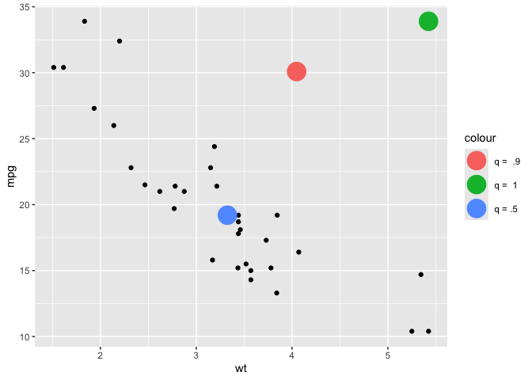
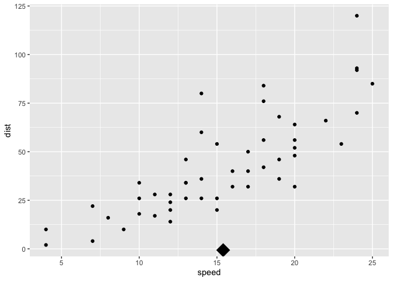

  - [`compute_rasa()`](#compute_rasa)
  - [then define StatRasagroup and
    stat\_group()](#then-define-statrasagroup-and-stat_group)
  - [define StatRasapanel and
    stat\_panel](#define-statrasapanel-and-stat_panel)
  - [define stat\_panel\_sf](#define-stat_panel_sf)
  - [Examples](#examples)
      - [geom\_means](#geom_means)
      - [geom\_center\_label](#geom_center_label)
      - [geom\_post](#geom_post)
      - [geom\_xmean](#geom_xmean)
      - [geom\_quantile](#geom_quantile)
      - [`geom_highlight()`](#geom_highlight)
  - [One-liners\!?\!?](#one-liners)
      - [`geom_xmean_line()` in 137
        characters](#geom_xmean_line-in-137-characters)
      - [`geom_xmean` in 99 characters](#geom_xmean-in-99-characters)
      - [`geom_post()` in 101 characters, `geom_expectedvalue()` in 113,
        `geom_expectedvalue_label()`
        171…](#geom_post-in-101-characters-geom_expectedvalue-in-113-geom_expectedvalue_label-171)
      - [`geom_means` in 131 characters](#geom_means-in-131-characters)
      - [`geom_grouplabel_at_means()`](#geom_grouplabel_at_means)
  - [Then using stat\_panel\_sf w/ helper package
    sf2stat](#then-using-stat_panel_sf-w-helper-package-sf2stat)
  - [Part II. Packaging and documentation 🚧
    ✅](#part-ii-packaging-and-documentation--)
      - [Phase 1. Minimal working
        package](#phase-1-minimal-working-package)
  - [Bit 8: Compile readme](#bit-8-compile-readme)
  - [Bit 9: Push to github](#bit-9-push-to-github)
  - [Bit 10: listen and iterate](#bit-10-listen-and-iterate)
      - [Phase 3: Settling and testing 🚧
        ✅](#phase-3-settling-and-testing--)
      - [Phase 4. Promote to wider audience… 🚧
        ✅](#phase-4-promote-to-wider-audience--)
      - [Phase 5: Harden/commit: Submit to CRAN/RUniverse 🚧
        ✅](#phase-5-hardencommit-submit-to-cranruniverse--)
  - [Appendix: Reports, Environment](#appendix-reports-environment)
      - [Description file complete? 🚧 ✅](#description-file-complete--)
      - [Environment 🚧 ✅](#environment--)
      - [`devtools::check()` report](#devtoolscheck-report)
      - [Package directory file tree](#package-directory-file-tree)

``` r
devtools::create(".")
```

# `compute_rasa()`

See Campitelli 2018 which creates statRasa and stat\_rasa.

<https://eliocamp.github.io/codigo-r/en/2018/05/how-to-make-a-generic-stat-in-ggplot2/>

We pull his function internal to StatRasa that defines compute\_group.
We can use in a few different places – now to define StatGroup and
StatPanel as well as their user-facing stat\_group() and stat\_panel()
and stat\_panel\_sf.

``` r
knitrExtra:::chunk_to_r("a_compute_rasa")
#> It seems you are currently knitting a Rmd/Qmd file. The parsing of the file will be done in a new R session.
```

``` r
compute_rasa <- function(data, scales, fun, fun.args) {
     # Change default arguments of the function to the 
     # values in fun.args
     args <- formals(fun)
     for (i in seq_along(fun.args)) {
        if (names(fun.args[i]) %in% names(fun.args)) {
           args[[names(fun.args[i])]] <- fun.args[[i]]
        } 
     }
     formals(fun) <- args
     
     # Apply function to data
     fun(data)
}
```

# then define StatRasagroup and stat\_group()

``` r
knitrExtra:::chunk_to_r("b_stat_group")
#> It seems you are currently knitting a Rmd/Qmd file. The parsing of the file will be done in a new R session.
```

``` r
# stat function used in ggplot - but reordered from conventional!
stat_group <- function(fun = NULL,
                       geom = "point", 
                       mapping = NULL, 
                       data = NULL,
                       position = "identity",
                       required_aes = NULL, 
                       default_aes = NULL, 
                       dropped_aes = NULL,
                      ...,
                      show.legend = NA,
                      inherit.aes = TRUE) {
  
   StatRasagroup <- ggplot2::ggproto(
   `_class` = "StatRasagroup", 
   `_inherit` = ggplot2::Stat,
   compute_group = compute_rasa
   )
  
   # Check arguments 
   if (!is.function(fun)) stop("fun must be a function")
   
   # Pass dotted arguments to a list
   fun.args <- match.call(expand.dots = FALSE)$`...`
   
   if(!is.null(required_aes)){StatRasagroup$required_aes <- required_aes}
   if(!is.null(default_aes)){StatRasagroup$default_aes <- default_aes}
   if(!is.null(dropped_aes)){StatRasagroup$dropped_aes <- dropped_aes}
   
   ggplot2::layer(
      data = data,
      mapping = mapping,
      stat = StatRasagroup,
      geom = geom,
      position = position,
      show.legend = show.legend,
      inherit.aes = inherit.aes,
      check.aes = FALSE,
      check.param = FALSE,
      params = list(
         fun = fun, 
         fun.args = fun.args,
         na.rm = FALSE,
         ...
      )
   )
}
```

-----

# define StatRasapanel and stat\_panel

``` r
knitrExtra:::chunk_to_r("c_stat_panel")
#> It seems you are currently knitting a Rmd/Qmd file. The parsing of the file will be done in a new R session.
```

``` r


# stat function used in ggplot - we reorder from conventional
stat_panel <- function(fun = NULL, 
                       geom = "point", 
                       mapping = NULL, data = NULL,
                      position = "identity",
                      required_aes = NULL,
                      default_aes = NULL,
                      dropped_aes = NULL,
                      ...,
                      show.legend = NA,
                      inherit.aes = TRUE) {

   StatRasapanel <- 
   ggplot2::ggproto("StatRasapanel", 
                   ggplot2::Stat,
                   compute_panel = compute_rasa)
  
   # Check arguments 
   if (!is.function(fun)) stop ("fun must be a function")
   
   # Pass dotted arguments to a list
   fun.args <- match.call(expand.dots = FALSE)$`...`
   
   if(!is.null(required_aes)){StatRasapanel$required_aes <- required_aes}
   if(!is.null(default_aes)){StatRasapanel$default_aes <- default_aes}
   if(!is.null(dropped_aes)){StatRasapanel$dropped_aes <- dropped_aes}

   ggplot2::layer(
      data = data,
      mapping = mapping,
      stat = StatRasapanel,
      geom = geom,
      position = position,
      show.legend = show.legend,
      inherit.aes = inherit.aes,
      check.aes = FALSE,
      check.param = FALSE,
      params = list(
         fun = fun, 
         fun.args = fun.args,
         na.rm = FALSE,
         ...
      )
   )
}
```

-----

# define stat\_panel\_sf

``` r
knitrExtra:::chunk_to_r("d_stat_panel_sf")
#> It seems you are currently knitting a Rmd/Qmd file. The parsing of the file will be done in a new R session.
#> Error in chunk_info[, "code"][[1]][[1]]: subscript out of bounds
```

`stat_panel_sf()` will use StatRasaPanel, but with layer\_sf under the
hood instead of layer. You should be able to declare crs (not convinced
we’ve got that working. ) Additionally, the ‘fun’ for the panel will
populate automatically if a geom\_ref\_argument is provided and the fun
argument is not provided.

``` r
# stat function used in ggplot - we reorder from conventional
stat_panel_sf <- function(geo_ref_data = NULL,
                          fun = NULL, 
                       geom = "sf", 
                       mapping = NULL, 
                       data = NULL,
                      position = "identity",
                      required_aes = NULL,
                      default_aes = NULL,
                      dropped_aes = NULL,
                      ...,
                      show.legend = NA,
                      inherit.aes = TRUE,
                      na.rm = FALSE,
                      crs = "NAD27" # "NAD27", 5070, "WGS84", "NAD83", 4326 , 3857
) {
  
  StatRasapanel <- 
   ggplot2::ggproto("StatRasapanel", 
                   ggplot2::Stat,
                   compute_panel = compute_rasa)
  
    if(!is.null(geo_ref_data) & is.null(fun)){
    
      
      fun <- function(data, keep_id = NULL, 
                                       drop_id = NULL, 
                                       stamp = FALSE){
  
             if(!stamp){data <- dplyr::inner_join(data, geo_ref_data)}
             if( stamp){data <- geo_ref_data }
             
             if(!is.null(keep_id)){ data <- dplyr::filter(data, id_col %in% keep_id) }
             if(!is.null(drop_id)){ data <- dplyr::filter(data, !(id_col %in% drop_id))}
             
             data
  
      }
    
    
  }
  
  
   # Check arguments 
   if (!is.function(fun)) stop ("fun must be a function")
   
   # Pass dotted arguments to a list
   fun.args <- match.call(expand.dots = FALSE)$`...`
   
   if(!is.null(required_aes)){StatRasapanel$required_aes <- required_aes}
   if(!is.null(default_aes)){StatRasapanel$default_aes <- default_aes}
   if(!is.null(dropped_aes)){StatRasapanel$dropped_aes <- dropped_aes}
   
     c(ggplot2::layer_sf(
              data = data,
              mapping = mapping,
              stat = StatRasapanel,  # proto object from step 2
              geom = geom,  # inherit other behavior
              position = position,
              show.legend = show.legend,
              inherit.aes = inherit.aes,
              check.aes = FALSE,
              check.param = FALSE,
              params = rlang::list2(
                fun = fun, 
                fun.args = fun.args,
                na.rm = na.rm, ...)
              ),
              
              ggplot2::coord_sf(crs = crs,
                       default_crs = sf::st_crs(crs),
                       datum = crs,
                       default = TRUE)
     )
   
}
```

# Examples

## geom\_means

``` r
library(tidyverse)
group_means <- function(data){
  
 data |> 
    summarise(x = mean(x),
              y = mean(y))
  
}

geom_means <- function(...){
  stat_group(fun = group_means, ...)
}

mtcars |>
  ggplot() + 
  aes(x = wt,
      y = mpg) + 
  geom_point() + 
  geom_means(size = 6)
```

<!-- -->

``` r

last_plot() + 
  aes(color = factor(cyl))
```

<!-- -->

## geom\_center\_label

``` r
group_label_at_center <- function(data){
  
 data %>% 
    group_by(label) %>% 
    summarise(x = mean(x, na.rm = T),
              y = mean(y, na.rm = T))
  
}

geom_center_label <- function(...){
  stat_group(fun = group_label_at_center, geom = GeomLabel, ...)
}


palmerpenguins::penguins |>
  ggplot() +
  aes(x = bill_length_mm,
      y = bill_depth_mm) +
  geom_point() +
  aes(label = "All") +
  geom_center_label()
#> Warning: Removed 2 rows containing missing values or values outside the scale range
#> (`geom_point()`).
```

<!-- -->

``` r


last_plot() +
  aes(color = species, label = species)
#> Warning: Removed 2 rows containing missing values or values outside the scale range
#> (`geom_point()`).
```

<!-- -->

``` r


geom_center_text <- function(...){
  stat_group(fun = group_label_at_center, geom = GeomText, ...)
}


palmerpenguins::penguins |>
  ggplot() +
  aes(x = bill_length_mm,
      y = bill_depth_mm) +
  geom_point(aes(color = bill_length_mm)) +
  aes(color = species) +
  geom_center_text(color = "Black",
    aes(label = species), 
                     
                    alpha = .8,
                   size = 5, 
                   fontface = "bold")
#> Warning: Removed 2 rows containing missing values or values outside the scale range
#> (`geom_point()`).
```

<!-- -->

``` r

layer_data(i = 2)
#>       label        x        y PANEL group colour size angle hjust vjust alpha
#> 1    Adelie 38.79139 18.34636     1    -1  Black    5     0   0.5   0.5   0.8
#> 2 Chinstrap 48.83382 18.42059     1    -1  Black    5     0   0.5   0.5   0.8
#> 3    Gentoo 47.50488 14.98211     1    -1  Black    5     0   0.5   0.5   0.8
#>   family fontface lineheight
#> 1            bold        1.2
#> 2            bold        1.2
#> 3            bold        1.2
```

## geom\_post

``` r
compute_post <- function(data){
  
  data %>% 
    mutate(xend = x,
           yend = 0)
  
}

geom_post <- function(...){
  stat_group(fun = compute_post, geom = "segment", ...)
}


data.frame(outcome = 0:1, prob = c(.4, .6)) |>
  ggplot() + 
  aes(x = outcome,
      y = prob) + 
  geom_post() + 
  geom_point() + 
  labs(title = "probability by outcome")
```

<!-- -->

## geom\_xmean

``` r
compute_xmean <- function(data){
  
  data %>% 
    summarize(xintercept = mean(x))
  
}

geom_xmean <- function(...){
  stat_group(fun = compute_xmean, geom = "vline", 
             dropped_aes = c("x", "y"), ...)
}

mtcars |>
  ggplot() + 
  aes(x = wt,
      y = mpg) + 
  geom_point() + 
  geom_xmean(linetype = "dashed")
```

<!-- -->

``` r

last_plot() + 
  aes(color = factor(cyl))
```

<!-- -->

## geom\_quantile

``` r
compute_xy_quantile <- function(data, q = .5){
  
  data %>% 
    summarise(x = quantile(x, q),
              y = quantile(y, q)) 
  
}

geom_quantile <- function(...){
  stat_group(fun = compute_xy_quantile, "point", ...)  #adding point means that aes is automatically figured out! ok
}

mtcars |>
  ggplot() +
  aes(x = wt,
      y = mpg) +
  geom_point() +
  geom_quantile(size = 8, aes(color = "q = .5"), q = .5) +
  geom_quantile(size = 8, q = 1, aes(color = "q =  1")) +
  geom_quantile(aes(color = "q =  .9"), size = 8, q = .9)
```

<!-- -->

## `geom_highlight()`

``` r
compute_panel_highlight <- function(data, which_id = NULL){

data %>% 
  arrange(highlight_condition) %>%
  mutate(group = fct_inorder(grouping))
  
}

geom_highlight <- function(geom = "line", ...){
  
  stat_panel(fun = compute_panel_highlight, 
             geom = geom, 
             default_aes = aes(color = after_stat(highlight_condition)),
             ...)
}

gapminder::gapminder %>% 
  filter(continent == "Americas") %>% 
  ggplot() + 
  aes(x = year, y = lifeExp, 
      grouping = country, 
      highlight_condition = 
        country == "Bolivia") + 
  geom_highlight(linewidth = 3)
```

<!-- -->

``` r

gapminder::gapminder %>% 
  filter(year == 2002) %>% 
  ggplot() + 
  aes(x = gdpPercap, y = lifeExp, 
      grouping = continent, 
      highlight_condition = 
        continent == "Europe") + 
  geom_highlight(geom = "point") + 
  scale_x_log10() + 
  scale_color_manual(values = c("grey", "darkolivegreen"))
```

<!-- -->

# One-liners\!?\!?

Since were organize with variable function input in first position and
geom in secton position, and we can do one-liners (or two) use
positioning for arguments.

## `geom_xmean_line()` in 137 characters

``` r
library(tidyverse)

geom_xmean_line <- function(...){stat_group(function(df) df |> summarize(xintercept = mean(x)), "vline", dropped_aes = c("x", "y"), ...)}


ggplot(cars) +
  aes(speed, dist) + 
  geom_point() + 
  geom_xmean_line(linetype = 'dashed')
```

<!-- -->

``` r
  
last_plot() + 
  aes(color = dist > 50)
```

<!-- -->

``` r

ggplot(cars) +
  aes(speed, dist) + 
  geom_point() + 
  geom_xmean_line(linetype = 'dashed', 
                  data = . %>% tail,
                  aes(color = dist > 50))
```

<!-- -->

``` r

ggplot(cars) +
  aes(speed, dist) + 
  geom_point() + 
  geom_xmean_line(data = . %>% filter(speed < 10))
```

<!-- -->

## `geom_xmean` in 99 characters

``` r
geom_xmean <- function(...){stat_group(function(df) df |> summarize(x = mean(x), y = I(.05)), "point", ...)}

ggplot(cars) +
  aes(speed, dist) + 
  geom_point() + 
  geom_xmean(size = 8, shape = "diamond") 
```

<!-- -->

``` r

last_plot() + 
  aes(color = dist > 50)
```

<!-- -->

## `geom_post()` in 101 characters, `geom_expectedvalue()` in 113, `geom_expectedvalue_label()` 171…

May I buy a visualy enhanced probability lesson for 400 characters? Yes
please.

``` r
geom_post <- function(...){stat_group(function(df) df |> mutate(xend = x, yend = 0), "segment", ...)}

data.frame(prob = c(.4,.6), outcome = c(0, 1)) %>% 
ggplot(data = .) +
  aes(outcome, prob) + 
  geom_post() +
  geom_point() 
```

<!-- -->

``` r

geom_expectedvalue <- function(...){stat_group(function(df) df |> summarise(x = sum(x*y), y = 0), "point", ...)} # point is defaut geom

last_plot() + 
  geom_expectedvalue()
```

<!-- -->

``` r

geom_expectedvalue_label <- function(...){stat_group(function(df) df |> summarise(x = sum(x*y), y = 0) |> mutate(label = round(x, 2)), "text", hjust = 1, vjust = 0, ...)}

last_plot() +
  geom_expectedvalue_label()
```

<!-- -->

### `geom_proportion()` and `geom_proportion_label()`

``` r
rep(1, 15) |> 
  c(0) %>% 
  data.frame(outcome = .) |>
  ggplot() + 
  aes(x = outcome) + 
  geom_dotplot()
#> Bin width defaults to 1/30 of the range of the data. Pick better value with
#> `binwidth`.
```

<!-- -->

``` r

geom_proportion <- function(...){stat_panel(function(df) df |> summarise(x = sum(x)/length(x), y = 0), ...)}   # this should work for T/F too when rasa_p is in play

last_plot() + 
  geom_proportion(shape = "triangle")
#> Bin width defaults to 1/30 of the range of the data. Pick better value with
#> `binwidth`.
```

<!-- -->

``` r

geom_proportion_label <- function(...){stat_panel(function(df) df |> summarise(x = sum(x)/length(x), y = 0) |> mutate(label = round(x,2)), vjust = 0, "text", ...)}   # this should work for T/F too when rasa_p is in play

last_plot() + 
  geom_proportion_label()
#> Bin width defaults to 1/30 of the range of the data. Pick better value with
#> `binwidth`.
```

<!-- -->

``` r

# last_plot() + 
#   geom_proportion_label() + 
#   ggsample::facet_bootstrap()
# 
# layer_data(i = 2)
# 
# 
# 
# rep(0:1, 10000) %>% # very large 50/50 sample
#   data.frame(outcome = .) |>
#   ggplot() + 
#   aes(x = outcome) + 
#   geom_dotplot() +
#   geom_proportion() + 
#   geom_proportion_label() + 
#   ggsample::facet_sample(n_facets = 25,
#     n_sampled = 16) ->
# p; p 
#   
# 
# layer_data(p, i = 2) |>
#   ggplot() + 
#   aes(x = x) + 
#   geom_rug() + 
#   geom_histogram()
```

## `geom_means` in 131 characters

``` r
geom_means <- function(...){stat_group(function(df) df |> summarize(x = mean(x, na.rm = T), y = mean(y, na.rm = T)), "point", ...)}

palmerpenguins::penguins %>% 
  ggplot() + 
  aes(bill_length_mm, bill_depth_mm) + 
  geom_point() + 
  geom_means(size = 7)
#> Warning: Removed 2 rows containing missing values or values outside the scale range
#> (`geom_point()`).
```

<!-- -->

``` r

last_plot() +
  geom_means(size = 8, shape = "diamond", aes(color = bill_depth_mm > 17))  # why does aes work here w/o mapping =
#> Warning: Removed 2 rows containing missing values or values outside the scale range
#> (`geom_point()`).
#> Warning: Removed 1 row containing missing values or values outside the scale range
#> (`geom_point()`).
```

<!-- -->

``` r


last_plot() +
  geom_means(size = 8, 
             shape = "square", 
             data = . %>% filter(species == "Chinstrap"),
             aes(color = bill_depth_mm > 17),
             alpha = .6) 
#> Warning: Removed 2 rows containing missing values or values outside the scale range
#> (`geom_point()`).
#> Removed 1 row containing missing values or values outside the scale range
#> (`geom_point()`).
```

<!-- -->

## `geom_grouplabel_at_means()`

``` r
geom_grouplabel_at_means <-  function(...){stat_group(function(df) df |> group_by(label) |> summarize(x = mean(x, na.rm = T), y = mean(y, na.rm = T)), "label", ...)}

palmerpenguins::penguins %>% 
  ggplot() + 
  aes(bill_length_mm, bill_depth_mm, label = species, group = species) + 
  geom_point() + 
  geom_grouplabel_at_means(size = 7)
#> Warning: Removed 2 rows containing missing values or values outside the scale range
#> (`geom_point()`).
```

<!-- -->

# Then using stat\_panel\_sf w/ helper package sf2stat

``` r
nc <- sf::st_read(system.file("shape/nc.shp", package="sf"))
#> Reading layer `nc' from data source 
#>   `/Library/Frameworks/R.framework/Versions/4.4-x86_64/Resources/library/sf/shape/nc.shp' 
#>   using driver `ESRI Shapefile'
#> Simple feature collection with 100 features and 14 fields
#> Geometry type: MULTIPOLYGON
#> Dimension:     XY
#> Bounding box:  xmin: -84.32385 ymin: 33.88199 xmax: -75.45698 ymax: 36.58965
#> Geodetic CRS:  NAD27

geo_reference_northcarolina_county <- nc |>
  dplyr::select(county_name = NAME, fips = FIPS) |>
  sf2stat:::sf_df_prep_for_stat(id_col_name = "county_name")


stat_nc_counties <- function(geom = "sf", ...){
  
  stat_panel_sf(geo_ref_data = geo_reference_northcarolina_county, 
                fun = NULL, 
                geom = geom, 
                default_aes = ggplot2::aes(label = after_stat(id_col)),
                ...)
  
}

nc %>% 
  sf::st_drop_geometry() %>% 
ggplot() + 
  aes(fips = FIPS) +
  stat_nc_counties() + 
  stat_nc_counties(geom = "text")
```

<!-- -->

``` r

nc %>% 
  sf::st_drop_geometry() %>% 
ggplot() + 
  aes(fips = FIPS) +
  stat_nc_counties() + 
  stat_nc_counties(geom = "text", 
                   data = . %>% head(),
                   aes(label = SID74)) 
```

<!-- -->

# Part II. Packaging and documentation 🚧 ✅

## Phase 1. Minimal working package

To build a minimal working package, 1) we’ll need to document
dependencies 2) send functions to .R files in the R folder, 3) do a
package check (this will A. Document our functions and B. this will help
us identify problems - for example if we’ve failed to declare a
dependency) and 4) install the package locally.

Then we’ll write up a quick advertisement for what our package is able
to do in the ‘traditional readme’ section. This gives us a chance to
test out the package.

``` r
### Bit 2a: in the function(s) you wrote above make sure dependencies to functions using '::' syntax to pkg functions 
usethis::use_package("ggplot2") # Bit 2b: document dependencies, w hypothetical ggplot2
```

``` r
# Bit 4: document functions and check that package is minimally viable
devtools::check(pkg = ".")  

# Bit 5: install package locally
devtools::install(pkg = ".", upgrade = "never") 
```

### Bit 7. Write traditional README that uses built package (also serves as a test of build). 🚧 ✅

The goal of the {statExpress} package is to …

Install package with:

    remotes::install_github("EvaMaeRey/statExpress")

Once functions are exported you can remove go to two colons, and when
things are are really finalized, then go without colons (and rearrange
your readme…)

``` r
library(statexpress)

geom_xmean <- function(...){statexpress:::stat_group(function(df) df |> summarize(x = mean(x), y = I(.05)), ...)}

ggplot(cars) +
  aes(speed, dist) + 
  geom_point() + 
  geom_xmean(size = 8, shape = "diamond") 
```

<!-- -->

``` r

last_plot() + 
  aes(color = dist > 50)
```

<!-- -->

``` r

last_plot() + 
  geom_xmean(mapping = aes(size = dist > 75))
#> Warning: Using size for a discrete variable is not advised.
```

<!-- -->

# Bit 8: Compile readme

# Bit 9: Push to github

# Bit 10: listen and iterate

## Phase 3: Settling and testing 🚧 ✅

### Bit A. Added a description and author information in the [DESCRIPTION file](https://r-pkgs.org/description.html) 🚧 ✅

### Bit B. Added [roxygen skeleton](https://r-pkgs.org/man.html) for exported functions. 🚧 ✅

### Bit D. Settle on [examples](https://r-pkgs.org/man.html#sec-man-examples). Put them in the roxygen skeleton and readme. 🚧 ✅

### Bit C. Chosen a [license](https://r-pkgs.org/license.html)? 🚧 ✅

``` r
usethis::use_mit_license()
```

### Bit D. Use life-cycle badge

``` r
usethis::use_lifecycle_badge("experimental") 
```

### Bit E. Written formal [tests](https://r-pkgs.org/testing-basics.html) of functions and save to test that folders 🚧 ✅

That would look like this…

``` r
library(testthat)

test_that("calc times 2 works", {
  expect_equal(times_two(4), 8)
  expect_equal(times_two(5), 10)
  
})
```

``` r
knitrExtra::chunk_to_tests_testthat("test_calc_times_two_works")
```

### Bit F. Check again. Addressed notes, warnings and errors. 🚧 ✅

``` r
devtools::check(pkg = ".")
```

## Phase 4. Promote to wider audience… 🚧 ✅

### Bit A. Package website built? 🚧 ✅

### Bit B. Package website deployed? 🚧 ✅

## Phase 5: Harden/commit: Submit to CRAN/RUniverse 🚧 ✅

# Appendix: Reports, Environment

## Description file complete? 🚧 ✅

``` r
readLines("DESCRIPTION")
```

## Environment 🚧 ✅

Here I just want to print the packages and the versions

``` r
all <- sessionInfo() |> print() |> capture.output()
all[11:17]
#> [1] ""                                                                         
#> [2] "time zone: America/Denver"                                                
#> [3] "tzcode source: internal"                                                  
#> [4] ""                                                                         
#> [5] "attached base packages:"                                                  
#> [6] "[1] stats     graphics  grDevices utils     datasets  methods   base     "
#> [7] ""
```

## `devtools::check()` report

``` r
devtools::check(pkg = ".")
```

## Package directory file tree

``` r
fs::dir_tree(recurse = T)
#> .
#> ├── DESCRIPTION
#> ├── NAMESPACE
#> ├── R
#> │   ├── a_compute_rasa.R
#> │   ├── b_stat_group.R
#> │   └── c_stat_panel.R
#> ├── README.Rmd
#> ├── README.md
#> ├── README_files
#> │   └── figure-gfm
#> │       ├── cars-1.png
#> │       ├── cars-2.png
#> │       ├── cars-3.png
#> │       ├── unnamed-chunk-10-1.png
#> │       ├── unnamed-chunk-10-2.png
#> │       ├── unnamed-chunk-11-1.png
#> │       ├── unnamed-chunk-11-2.png
#> │       ├── unnamed-chunk-12-1.png
#> │       ├── unnamed-chunk-12-2.png
#> │       ├── unnamed-chunk-12-3.png
#> │       ├── unnamed-chunk-13-1.png
#> │       ├── unnamed-chunk-13-2.png
#> │       ├── unnamed-chunk-13-3.png
#> │       ├── unnamed-chunk-14-1.png
#> │       ├── unnamed-chunk-14-2.png
#> │       ├── unnamed-chunk-14-3.png
#> │       ├── unnamed-chunk-14-4.png
#> │       ├── unnamed-chunk-15-1.png
#> │       ├── unnamed-chunk-15-2.png
#> │       ├── unnamed-chunk-15-3.png
#> │       ├── unnamed-chunk-16-1.png
#> │       ├── unnamed-chunk-16-2.png
#> │       ├── unnamed-chunk-16-3.png
#> │       ├── unnamed-chunk-17-1.png
#> │       ├── unnamed-chunk-17-2.png
#> │       ├── unnamed-chunk-17-3.png
#> │       ├── unnamed-chunk-18-1.png
#> │       ├── unnamed-chunk-19-1.png
#> │       ├── unnamed-chunk-19-2.png
#> │       ├── unnamed-chunk-22-1.png
#> │       ├── unnamed-chunk-22-2.png
#> │       ├── unnamed-chunk-22-3.png
#> │       ├── unnamed-chunk-7-1.png
#> │       ├── unnamed-chunk-7-2.png
#> │       ├── unnamed-chunk-8-1.png
#> │       ├── unnamed-chunk-8-2.png
#> │       ├── unnamed-chunk-8-3.png
#> │       ├── unnamed-chunk-9-1.png
#> │       ├── unnamed-chunk-9-2.png
#> │       └── unnamed-chunk-9-3.png
#> ├── man
#> └── statexpress.Rproj
```
